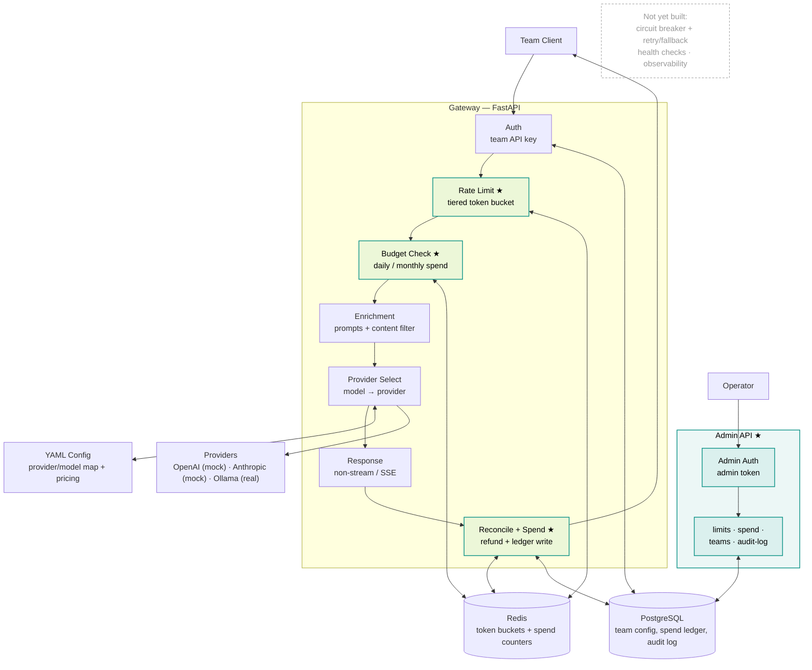

# Plexon

A production-style API gateway that sits in front of an organization's LLM calls. It authenticates teams, enforces per-team rate limits and budgets, transparently routes around provider outages, and gives unified observability across every LLM interaction — regardless of which underlying provider (OpenAI, Anthropic, Ollama) actually served the request.

Callers talk to Plexon exactly like they'd talk to OpenAI's Chat Completions API. Plexon decides which provider actually serves the request, retries and falls back on failure, and meters every call for rate limits, budget, and observability — without the caller ever knowing which provider was behind it.

> Portfolio/demo project, not a production system for a real organization — see [Non-Goals](#non-goals) below.

## Status

Phase 0 (`proxy-layer`) is merged; phase 1 (`ratelimit-budget`) is complete and in this PR — the gateway proxies, authenticates, rate-limits, and enforces budget today. Resilience, observability, and the load-tested full stack are still ahead — see [Build Plan](#build-plan) below for progress.

## Why This Project

Every company with more than one team using LLMs ends up building something like this. It's infrastructure engineering applied to AI: rate limiting, multi-provider failover, and observability — not model-building.

## Core Features

- **Unified proxy layer** — normalizes every request to an OpenAI-compatible schema and translates to/from each provider's native format, so callers never know which provider served them. Supports both streaming and non-streaming responses, and per-team request enrichment (system prompts, compliance disclaimers, rule-based content filters).
- **Rate limiting & budget enforcement** — per-team token-bucket rate limits (requests/min, tokens/min) enforced atomically in Redis, with tiered priority ceilings for `realtime` vs `batch` traffic. Per-team dollar budgets with an 80% warning and a hard block at 100%. Live admin API for adjusting limits without a restart.
- **Fallback & resilience** — background health checks per provider-model combination, fallback chains defined per model tier, exponential-backoff retry (up to 3 attempts) for retryable errors only, and a circuit breaker (closed → open → half-open) per provider with every transition logged.
- **Observability** — OpenTelemetry traces (→ Grafana Tempo) across every request stage, Prometheus metrics (RPS, error rate, latency percentiles, token throughput, cost, fallback rate, circuit-breaker transitions), three provisioned Grafana dashboards (Operations, Business, Performance), and Slack alerting with actionable context.
- **Testing & load** — integration tests against mocked providers with stateless per-request fault injection (no real API keys or network calls required), plus a Locust load test targeting 5,000+ concurrent requests at <10ms gateway overhead.

## Architecture

This diagram reflects what's actually built as of the current phase (see [Build Plan](#build-plan)) — it grows one phase at a time rather than showing the end-state up front.


★ = added this phase (`ratelimit-budget`)

`auth` reads Postgres for team keys/config; `rate limit` and `budget check` run against Redis before the request is allowed to proceed (429 / 402 respectively), gating `enrichment` and `provider select` exactly like before. After the provider responds, `reconcile + spend` refunds any over-reserved token-bucket capacity and writes the real cost to Redis (fast counter) and Postgres (`spend_ledger`, source of truth). The admin API is a separate authenticated path — a distinct token type from team keys — used to manage limits, inspect spend, provision teams, and read the audit log. Streaming translates each provider's native stream chunks to OpenAI-style SSE in real time, with the same reconcile/ledger step running once the stream completes. Circuit breaking, retry/fallback, health checks, and observability land in later phases and will be added to this diagram as they're built. Full end-state request-flow spec in [`docs/TRD.md`](docs/TRD.md) §3.

**State is split three ways, by change frequency and durability:**

| Store | Holds | Why |
|---|---|---|
| **Redis** (hot-path) | rate-limit token buckets, circuit-breaker state, provider health status, running spend counter | fast-path enforcement only, never the system of record — rebuildable from Postgres |
| **PostgreSQL** (durable) | team configs, per-request spend ledger, admin audit log, circuit-breaker/health history | source of truth; per-team settings edited live via the admin API, no restart |
| **YAML** (static, hot-reloaded) | provider endpoints, fallback chains, circuit-breaker thresholds, health-check intervals, per-model pricing | global/rarely-changed settings only, never per-team |

The gateway process itself is stateless — nothing important lives only in memory — so the design supports horizontal scaling without rework, even though the demo runs a single instance.

Full detail: [`docs/ARCHITECTURE.md`](docs/ARCHITECTURE.md) (condensed) and [`docs/TRD.md`](docs/TRD.md) (data model, API spec, provider-adapter interface, deployment services).

### Directory Structure

```
plexon/
├── gateway/
│   ├── main.py
│   ├── auth/            # team key + admin token lookup
│   ├── ratelimit/        # Redis token bucket, tier ceilings
│   ├── providers/        # adapters: openai, anthropic, ollama
│   ├── resilience/       # circuit breaker, retry/backoff, health checks
│   ├── enrichment/       # system prompts, content filter
│   ├── admin/            # admin API routes
│   ├── observability/    # OTel spans, Prometheus metrics
│   └── config/           # YAML loader + hot reload
├── mocks/                 # mock OpenAI/Anthropic servers with fault injection
├── tests/
│   ├── integration/
│   └── load/               # Locust scenarios
├── deploy/
│   ├── docker-compose.yml
│   ├── grafana/            # provisioned dashboards
│   └── prometheus/
├── scripts/
│   └── setup_demo_teams.py
└── docs/
```

## Tech Stack

| Layer | Choice |
|---|---|
| Language / framework | Python 3.11+, FastAPI |
| Hot-path store | Redis |
| Durable store | PostgreSQL |
| Static config | YAML, file-watched hot reload |
| Tracing | OpenTelemetry → Grafana Tempo |
| Metrics | Prometheus |
| Dashboards | Grafana |
| Alerting | Slack incoming webhook (env-gated) |
| Providers | OpenAI (mocked), Anthropic (mocked), Ollama (real) |
| Load testing | Locust |
| Retry / backoff | `tenacity` |
| CI | GitHub Actions, real Redis/Postgres service containers |
| Packaging | `uv` |
| Containerization | Docker + Docker Compose |

## API Surface

There is no custom UI. The product surfaces are the gateway API, the admin API, and Grafana's provisioned dashboards.

| Method | Path | Auth | Notes |
|---|---|---|---|
| POST | `/v1/chat/completions` | team API key | OpenAI-compatible; `stream: true/false`; optional `X-Priority: realtime\|batch` header |
| GET | `/v1/models` | team API key | models allowed for the caller's team |
| GET | `/healthz` | none | liveness probe |
| GET | `/admin/teams/{team_id}/status` | admin token | current rate-limit/budget status |
| PATCH | `/admin/teams/{team_id}/limits` | admin token | adjust rate limits/budget live |
| GET | `/admin/teams/{team_id}/spend` | admin token | spend dashboard data |
| POST | `/admin/teams` | admin token | create a team |
| GET | `/admin/audit-log` | admin token | query audit history |
| POST | `/admin/config/reload` | admin token | manual YAML reload trigger |

Team API keys and admin tokens are two independent opaque-token systems — never a single token encoding both.

## Getting Started

```bash
uvicorn gateway.main:app --reload               # dev server
pytest                                           # tests (mocked providers — no API keys or network calls needed)
ruff check .                                     # lint
docker compose -f deploy/docker-compose.yml up   # full stack: gateway, Redis, Postgres, Prometheus, Grafana, Tempo, mocks
python3 scripts/setup_demo_teams.py              # seed demo teams with varied rate limits/priorities
```

## Build Plan

Implementation is split into 5 [Harness](.claude/commands/harness.md) phases, each on its own `feat-{phase}` branch, run via `scripts/execute.py`:

| # | Phase | Covers | Status |
|---|---|---|---|
| 0 | `proxy-layer` | Project setup, provider abstraction, auth/routing, streaming passthrough, enrichment | ✅ merged |
| 1 | `ratelimit-budget` | Token buckets, budget caps, tiered limits, admin API | 🔨 this PR |
| 2 | `resilience` | Health checks, fallback routing, retry/backoff, circuit breakers | ⏳ not started |
| 3 | `observability` | OTel spans, Prometheus metrics, Grafana dashboards, alerting | ⏳ not started |
| 4 | `test-load` | Integration test suite, Locust load test, full Docker Compose stack | ⏳ not started |

A final polish phase (demo recording + narrative) is done manually, outside Harness.

## Non-Goals

- Not a production system for a real organization — no key rotation, no multi-region HA, no real user-account/RBAC system.
- Not a content-moderation project — content filtering is rule-based (keyword/regex), not an ML classifier.
- Not optimizing for raw throughput as the headline story.

## Documentation

| Doc | Contents |
|---|---|
| [`docs/PRD.md`](docs/PRD.md) | Product requirements: goals, users, features, success metrics, assumptions, open risks |
| [`docs/ARCHITECTURE.md`](docs/ARCHITECTURE.md) | Condensed architecture: directory structure, patterns, data flow, state management |
| [`docs/TRD.md`](docs/TRD.md) | Technical reference: system components, request flow, data model (SQL/Redis schemas), API spec, provider-adapter interface, observability detail, deployment |
| [`docs/ADR.md`](docs/ADR.md) | Architecture decision records — the rationale behind every major technical choice |
